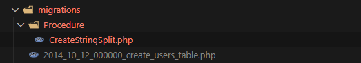
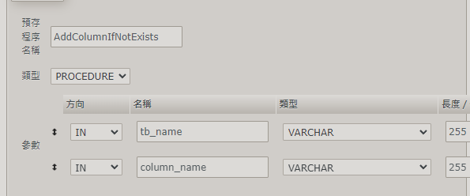
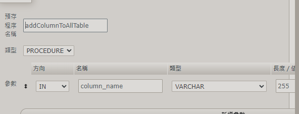
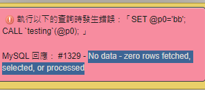

# adding a procedure in laravel migration

```
<?php
use Illuminate\Database\Migrations\Migration;

class CreateStringSplit extends Migration
{
    /**
     * Run the migrations.
     *
     * @return void
     */
    public function up()
    {
        $procedure="
        DROP TEMPORARY TABLE IF EXISTS temp_table;
        DELIMITER //
      
        CREATE PROCEDURE splitColumnToTable(
          in_table_name VARCHAR(255),
          in_column_name VARCHAR(255),
          in_delimiter CHAR(1)
        )
        BEGIN
          SET @sql = CONCAT(
            'CREATE TEMPORARY TABLE temp_table (value LongText NULL); ',
            'INSERT INTO temp_table (value) ',
            'SELECT ',
            in_column_name,
            ' FROM ',
            in_table_name
          );
          
          SET @sql = CONCAT(
            'SELECT value ',
            'FROM temp_table ',
            'WHERE value = ',
            QUOTE(CONCAT('%', in_delimiter, '%'))
          );
          
          PREPARE stmt FROM @sql;
          EXECUTE stmt;
          DEALLOCATE PREPARE stmt;
        END //
        
        DELIMITER ;
        

     
        ";

  
        \DB::unprepared($procedure);
    }
  
    /**
     * Reverse the migrations.
     *
     * @return void
     */
    public function down()
    {
        \DB::unprepared("DROP PROCEDURE IF EXISTS `splitColumnToTable`");
    }
}

```
the work directory is as follow 

You can use procedure like a function

if you want to use procedure that has been built


use call method

call splitColumnToTable()


# sql procedure

 **剛剛的做法是在laravel 建立 procedure的方法**

 **現在介紹的是sql 如何使用procedure， 也就是說在laravel建立完procedure後 的用法**


# 一些自己建立的procedure 方便使用

## sql procedure(**#接受兩個參數**)

```
BEGIN
  DECLARE columnCount INT;
   SET @query = CONCAT(
 'SELECT COUNT(*) INTO @columnCount FROM INFORMATION_SCHEMA.COLUMNS WHERE `table_name` = \'',tb_name,'\' AND ------`table_schema` = DATABASE() AND `COLUMN_NAME` = \'', column_name, '\';');
    PREPARE stmt FROM @query;
    EXECUTE stmt;
    DEALLOCATE PREPARE stmt;

--    SET @resultQuery=CONCAT('SELECT * FROM INFORMATION_SCHEMA.COLUMNS
--     	WHERE `table_name` = \'intlpakabouts\'
--      AND `table_schema` = DATABASE()
--        AND `COLUMN_NAME` = \'',column_name,'\';');
--     PREPARE stmt FROM @resultQuery;
--      EXECUTE stmt;
--      DEALLOCATE PREPARE stmt;

--   If the column does not exist, add it to the table
 IF @columnCount = 0 THEN
        SET @alterQuery = CONCAT(
            'ALTER TABLE `',tb_name,'` ADD `', column_name, '` VARCHAR(191) NULL DEFAULT NULL;'
        );
        PREPARE alterStmt FROM  @alterQuery;
        EXECUTE alterStmt;
        DEALLOCATE PREPARE alterStmt;
  END IF;

END
```
## addColumnToAllTable(**#接受一個參數**)

```
BEGIN
    DECLARE var_table_name VARCHAR(255);


    DECLARE result CURSOR FOR
    SELECT DISTINCT `table_name`
    FROM INFORMATION_SCHEMA.COLUMNS
    WHERE `table_schema` = DATABASE();

    -- SET column_name variable to the desired value

    OPEN result;
    result_loop:LOOP
        FETCH result INTO var_table_name;

        -- Check for the end of the cursor
         IF (var_table_name IS NULL) THEN
            LEAVE result_loop;
         END IF;

        -- Call the procedure using the variables as parameters
        CALL AddColumnIfNotExists(var_table_name, column_name);

    END LOOP;
    CLOSE result;
END
```

執行結果:
這個不是錯誤，因為迴圈結束了，所以才有這樣的顯示。



